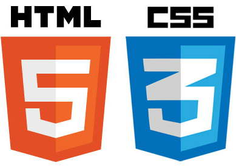

# Slicing Code Guidelines


Here we cover technologies, general guidelines and tips describing how to write transparent and readable code in order to keep the stylesheet scalable and maintainable.

## Index
- [Languages & Frameworks](#languages--frameworks)
- [Getting started](#getting-started)
- [Architecture](#architecture)
  - [Component structure](#component-structure)
  - [Directory structure](#directory-structure)
- [Syntax & Formatting](#syntax--formatting)
  - [ID selectors](#id-selectors)
  - [Location independence](#location-independence)
  - [Selector nesting](#selector-nesting)
  - [Extending classes](#extending-classes)
  - [Mixins & Control directives](#mixins--control-directives)
- [Naming](#naming)
- [Variables](#variables)
  - [Colors](#colors)
  - [Responsive breakpoints](#responsive-breakpoints)
- [Typography](#typography)
- [Layout](#layout)
- [Deployment](#deployment)

## Languages & Frameworks

Unless you are working on an existing project, or the back-end developer prefers to set the environment in one of the JavaScipt front-end frameworks (AngularJS, React, VueJS), you'll need a building tool.

#### Webpack

Use [Webpack](https://webpack.js.org/) module bundler to bundle all of the js files into a single production ready file and minimize http requests, process Sass / Less into CSS and convert JSX or ES6-7-8 into vanilla JS which browsers understand.

#### Grunt

You can also use [Grunt](https://gruntjs.com/getting-started) task runner for building production ready files. There will be no obvious differences in the final stage, even if you choose to use its alternative [Gulp](https://gulpjs.com/), but Grunt has been around for much longer, so it’s already well documented with lots of answers.

#### Gatsby

For someone who is working on front-end technologies, you should already be familiar with static site generators as [Gatsbyjs](https://www.gatsbyjs.org/) and give it a try as a third alternative for the setup.

For the stylesheet, prefer [Sass](https://sass-lang.com/) CSS preprocessor over [Less](http://lesscss.org/) due to the same popularity reason.

Prefer to build the app using custom [CSS Grid](https://css-tricks.com/snippets/css/complete-guide-grid/) or [Flexbox](https://css-tricks.com/snippets/css/a-guide-to-flexbox/) layout. Depending on the size of the project or the client's request, you can use [Bootstrap 4](https://getbootstrap.com/docs/4.1/getting-started/introduction/) component library for more faster and commonly accepted development.

## Getting started

To get started make sure you have the above listed technologies installed on your computer. Check their version number and update to the latest.

Install all libraries through [npm](https://www.npmjs.com/) or [yarn](https://yarnpkg.com/lang/en/) package managers * and ensure that your [Node.js](https://nodejs.org/en/) is up-to-date.

> \* Do not copy Bootstrap files to the project source for any reason.


Depending on the approach you choose, follow the setup guide:

- [Setup the Webpack.js](https://github.com/jovanovskajovana/sass-webpack-build-template).

- [Setup the Gruntfile.js](https://github.com/jovanovskajovana/sass-plus-grunt-build-template).

- [Setup Gatsby](https://github.com/jovanovskajovana/gatsby-starter-styled-components).

## Architecture

To keep stylesheets short, efficient, and easier to maintain, build the interface as a collection of components.

Components can be anything, as long as they:
- do one thing and one thing only;
- are re-usable and re-used across the project;
- are independent.

### Component structure

To make each components able to adapt within page theme, limit the declarations to only structural styles, such as dimensions (width/height), padding, margins, alignment, etc. Exclude styles such as colors, shadows, background rules, etc.

Here is an example of a button component partial:

```
.btn {
  font-size: 12px;
  line-height: 1;
  padding: 13px 16px;
  border-radius: 2px;
  font-weight: 600;
  width: 100%;
}

.btn-default {
  color: $white;
  background-color: $blue;
  border-color: $blue;

  &:hover {
    background-color: $blue-light;
    border-color: $blue-light;
  }

  &:focus,
  &:active {
    background-color: $blue;
    border-color: $blue;
  }
}

.btn-ghost {
  color: $black;
  background-color: $smoke;
  border-color: $anti-flash;

  &:hover {
    background-color: $anti-flash;
    border-color: $anti-flash;
  }

  &:focus,
  &:active {
    background-color: $smoke;
    border-color: $anti-flash;
  }
}
```
### Directory structure

Split the code in separate folders, such as `base/`, `components/`, `layout/`, and `pages/`. If you're not dealing with a huge project, you can have all your partials stuffed into `common/` and `pages/` folders, and a single file at the root level, called `main.scss`, which imports them all to be compiled into a CSS stylesheet.

```
sass/
    |
    |– common/
    |   |– _base.scss           # Global html rules
    |   |– _buttons.scss        # Buttons
    |   |– _footer.scss         # Footer
    |   |– _forms.scss          # Form components
    |   |– _header.scss         # Header
    |   |– _layout.scss         # Basic layouts
    |   |– _links.scss          # Links
    |   |– _margins.scss        # Spacing helpers
    |   |– _modal.scss          # Modals
    |   |– _tooltip.scss        # Tooltip
    |   |– _typography.scss     # Typography rules
    |   |– _variables.scss      # Sass Variables
    |
    |– pages/
    |   |– _contact.scss        # Contact page specific styles
    |   |– _home.scss           # Home page specific styles
    |   |– _news.scss           # News page specific styles
    |
    |
    `– main.scss                # Main Sass file
```

#### Common folder

For smaller components, there is the `common/` folder. It contains all kind of specific modules like a button, slider, form elements and basically everything used throughout the entire application. There are usually a lot of files in `common/` since the whole site/application should be mostly composed of tiny modules.

#### Pages folder

We put all the page-specific styles in a `pages/` folder, in a file named after the page. For instance, because it’s not uncommon to have specific styles for the home page, there is a need for a `_home.scss` file in `pages/`.

#### Main file

The main file (labelled `main.scss`) is the only Sass file from the whole code base not to begin with an underscore. This file should not contain anything but `@import` and comments.

```
// Variables

@import 'common/variables';

// Layouts

@import 'common/base';
@import 'common/typography';
@import 'common/layout';

// Helpers

@import 'common/margins';

//Components

@import 'common/links';
@import 'common/buttons';
@import 'common/forms';
@import 'common/modal';
@import 'common/tooltip';
@import 'common/header';
@import 'common/footer';

//Pages

@import 'pages/home';
@import 'pages/news';
@import 'pages/contact';
```
## Syntax & Formatting

When several developers are involved in writing CSS on the same project, having a standard way of writing CSS means that code will always look and feel familiar to all members of the team.

Here are some general rules:
- Use soft tabs (2 spaces) for indentation.
- Prefer dashes over camelCasing in class names.
- Do not use ID selectors.
- When using multiple selectors in a rule declaration, give each selector its own line.
- Put a space before the opening brace { in rule declarations.
- In properties, put a space after, but not before, the : character.
- Put closing braces } of rule declarations on a new line.
- Put blank lines between rule declarations.

```
// Bad
.section{
    border-radius: 50%;
    border:2px solid $white; }
.foo, .baz, .p {
    // ...
}
#user-name {
  // ...
}

// Good
.section {
  border-radius: 50%;
  border: 2px solid $white;
}

.foo,
.baz,
.p {
  // ...
}
```
Do not fix problems with `!important`. Use `!important` purposefully.

```
// Bad
.component {
  width: 37.4% !important;
}

// Good
.hidden {
  display: none !important
}
```

Don’t use unnecessary tag selectors.

```
// Bad
p.body__text { }

// Good
.body__text
```

### ID selectors

While it is possible to select elements by ID in CSS, it is generally considered an anti-pattern. ID selectors introduce an unnecessarily high level of specificity to our rule declarations, and they are not reusable. They should be reserved for JavaScript, so don’t use IDs for styles.

```
// Bad
#component { }

// Good
.component { }
```

### Location independence

Given the possible future change of the UI and the more component-based architecture, it is in our interests not to style things based on where they are, but on what they are. Our components’ styling should remain entirely location independent.

```
.submit a { }
```

This would be a poor selector intent - it will style any and every link inside of a `.submit` to look like a button. It is also pretty wasteful as a result of being locationally dependent. A far better selector would be:

```
.btn { }
```

This single class doesn’t have any dependencies and can be reused anywhere outside of `.submit` and will always carry its correct styling.

### Selector nesting

Sass provides nesting functionality which is a way for stylesheet authors to compute long selectors by nesting shorter selectors within each others. That is to say, by writing this:

```
.navbar {
  color: red;

  .navbar-brand {
    font-size: 24px;
  }
}
```

...which will be compiled to CSS:

```
.navbar { color: $red; }

.navbar .navbar-brand { font-size: 24px; }
```

When nesting Sass, stick to the same two (2) spaces, and also leave a blank line before the nested ruleset.

Do not nest selectors more than three (3) levels deep!

```
.page-container {

  .content {

    .profile {
      // STOP!
    }
  }
}
```

### Extending classes

While the `@extend` directive is a powerful feature of SASS, it can easily make the output CSS much more complex and hard to digest so it is best to avoid using it.

However, there are many scenarios where extending selectors are helpful and worthwhile. For instance, when the extending `.class` or `%placeholder` selector is 'a kind of' the extended selector.  An `.error` is a kind of `.warning`, so .`error` can `@extend .warning`.

Use extend on `%placeholders` primarily, not on actual selectors.

```
%section {
  margin-top: 10px;
}

.section-news {
  @extend .section;
  background-color: $white;
}

```

When extending classes, only extend a `class` with another `class`, never a complex selector.

```
// Bad
.modal-xl {
  @extend %modal;

  > .button {
    @extend %button;
  }
}

// Good
.modal-xl {
  @extend %modal;
}
```

### Mixins & Control directives

Mixins and Control directives should be used to simplify the code, add clarity, or abstract complexity, but note that if you are not compressing your payload, this may contribute to unnecessary code duplication in the resulting styles.

If you spot a group of CSS properties that always appear together for a reason, you can generate them by SassScript basic control directives and expressions. For instance, padding and margin helper is always welcomed.

```
$spacing-sizes: 10, 20, 30, 40, 50, 60, 70, 80, 90, 100;

/* Prefix classes for spacings */
$spacing-classes: (
  'p': padding,
  'pt': padding-top,
  'pb': padding-bottom,
  'pr': padding-right,
  'pl': padding-left,
  'm': margin,
  'mt': margin-top,
  'mb': margin-bottom,
  'mr': margin-right,
  'ml': margin-left
);

/* Spacings class loop */
@each $prefix, $meaning in $spacing-classes {
  @each $size in $spacing-sizes {
    .#{$prefix}#{$size} {
      #{$meaning}: $size * 1px !important;
    }
  }
}
```

Another valid example would be a mixin to size an element, defining both width and height at the same time.

```
// Definition
@mixin size($width, $height: $width) {
  width: $width;
  height: $height;
}

// Usage
.square {
  @include size(20px);
}
```

Don’t over think your code, if a mixin ends up being longer than 20 lines or so, then it should be either split into smaller chunks or completely revised.

## Naming

When it comes to naming, the most important thing is consistency. The recommended way to do this is using an existing methodology like [BEM](https://en.bem.info/methodology/) (Block, Element, Modifier), or use a custom one that’s clearly defined *.

The point of BEM is to tell other developers more about what a piece of markup is doing from its name alone. From the class name we should be able to see how the chunks are related, something might be a component, something might be a child or element.

```
// Block
.message {
  border: 1px solid;
  font-weight: bold;

  // Element
  .message__content {
    padding: 3em;
  }
}

// Modifier
.message--success {
  background-color: $green;

  .message__content {
    padding: 1em;
  }
}

// Modifier
.message--error {
  background-color: $red;
}
```
> \*  With modern front-end frameworks we're trying to use CSS-in-JS or generated class names as much as possible, so having the BEM in mind, keep the naming short and simple.

#### Class names

- Dashes serve as natural breaks in related class (e.g. `.btn` and `.btn-danger`).
- Avoid excessive and arbitrary shorthand notation, `btn` is useful for button, but `.s` doesn't mean anything.
- Keep classes as short and succinct as possible.
- Use meaningful names and structural names over presentational.
- Prefix classes based on the closest parent or base class.

```
// Bad
.t { ... }
.red { ... }
.header { ... }

// Good
.tweet { ... }
.important { ... }
.tweet-header { ... }
```

Write classes semantically. Name its function not its appearance.

```
// What is a c1-xr? Use a more explicit name.
.c1-xr { }
```

Avoid presentation or location-specific words in names, as this will cause problems when you need to change the color, width, or feature later.

```
// Bad
.blue
.text-gray
.100width-box

// Good
.warning
.primary
.lg-box
```

#### Selectors

Minimize selectors tightly coupled to the DOM. Consider adding a class to the elements you want to match when your selector exceeds three (3) structural pseudo-classes, descendant or sibling combinators.

```
// Bad
div:first-of-type :last-child > p ~ *

// Good
div:first-of-type .info
```

## Variables

Create a new variables in the following circumstances:
- The value is repeated twice.
- The value is likely to be updated at least once.
- All occurrences of the value are tied to the variable (for example not by coincidence).

Prefer dash-cased variable names (e.g. `$blue-light`) over camelCased or snake_cased variable names. It is acceptable to prefix variable names that are intended to be used only within the same file with an underscore (e.g. `$_my-variable`).

### Colors

Split colors into categories for specific use. The first category should be Primary colors, which are used for text, buttons and other UI elements throughout the app. Another one can be Background colors used for various backgrounds throughout the app, and so on.

```
// Primary colors

$orange: #fc9d2b;
$orange-dark: #e69027;
$blue: #3486ef;
$blue-dark: #3079d9;
$green: #36d571;
$green-dark: #009437;

// Grey colors

$black: #2b2e33;
$pewter: #9fa9ba;
$platinum: #e6e6e6;
$anti-flash: #f2f2f2;
$smoke: #f7f7f7;
$white: #fff;
$transparent: transparent;

// Font colors

$main: #fe9e0c;
$secondary: #3486ef;
$positive: #36d571;
$negative: #ff5050;

// Background colors

$background-primary: #f7f7f7;
$background-negative: #ffe4e4;
$background-positive: #d4edda;
```
### Responsive breakpoints

In order to keep the things simple and follow the standards in the same time, use the following media query ranges or breakpoints:

```
// Media query variables

$screen-xs-max: 374px;
$screen-sm-max: 750px;
$screen-md-max: 992px;
$screen-lg-max: 1200px;
$screen-xl-max: 1600px;
```

## Typography

Carefully structure the fonts used through the application. When used effectively, the right typeface and weight can guide the user around the page and effectively present data in a hierarchical manner.

```
// Font sizes

.title-xxl {
  font-size: 48px;
  line-height: 56px;
}

.title-xl {
  font-size: 20px;
  line-height: 32px;
}

.title-m {
  font-size: 16px;
  line-height: 24px;
}

.title-s {
  font-size: 16px;
  line-height: 24px;
}

.default-s {
  font-size: 14px;
  line-height: 20px;
}

.uppercase-m {
  font-size: 12px;
  line-height: 16px;
  text-transform: uppercase;
}

// Font weight

.semibold {
  font-weight: 600;
}

.regular {
  font-weight: normal;
}

.thin {
  font-weight: 300;
}
```

## Layout

Depending on the type of project it is important to decide which layout structure will best suit.

The basic [Bootstrap system](https://getbootstrap.com/docs/4.0/layout/grid/) includes wrapping containers, a powerful 12-column grid system with a series of containers and rows to layout and align content, a flexible media object, and responsive utility classes.

You can also build application basics upon CSS Grid or Flexbox layout. In both examples be careful to stick to the general rules and check the browser compatibility.

Refer to the following documentation and tutorials:
- Flexbox:
  - https://css-tricks.com/snippets/css/a-guide-to-flexbox/
  - https://flexbox.io/
  - [Built example](https://github.com/jovanovskajovana/flexbox-vs-cssgrid)
- CSS Grid:
  - https://css-tricks.com/snippets/css/complete-guide-grid/
  - https://cssgrid.io/
  - [Built example](https://github.com/jovanovskajovana/flexbox-vs-cssgrid)

## Deployment

You wrapped up everything and at this point you need to host yut built site somewhere. Fortunately, there are great services that provide that for free in just a few steps.
- [Netlify](https://www.netlify.com/)
- [GitHub Pages](https://pages.github.com/)
- [Zeit](https://zeit.co/)
- [Stackbit](https://www.stackbit.com/)
